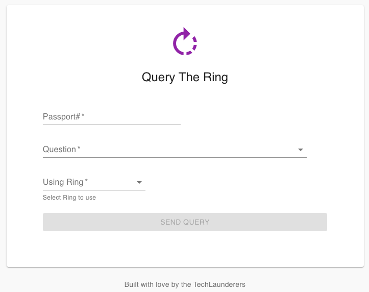
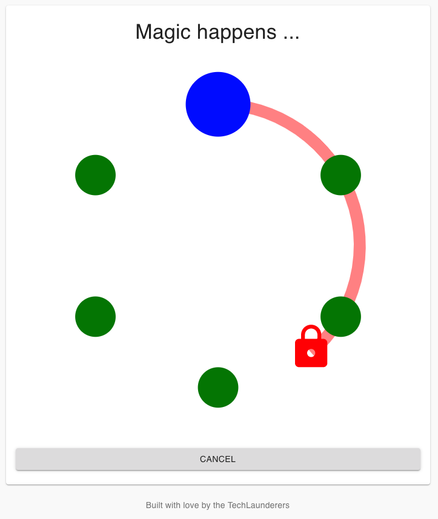
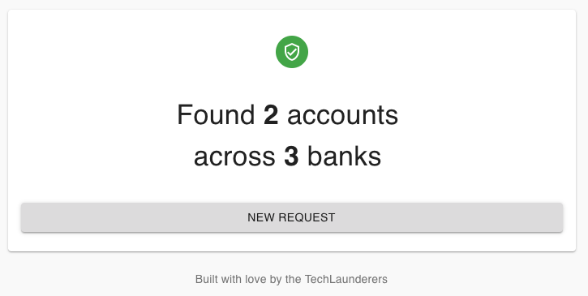

# Overview

Implements a simple Web UI to ask a few questions to a backend which
calculates the answer in a privacy preserving way.

The UI consists of three screens. The first is a form which allows the investigator
to enter the passport # of the individual they want to query for, as well selecting a
question and the 'ring' to use (the last two form entries are being ignored by the backend).

On 'submit` the UI changes to a waiting animation roughly animating what is happening in the back - 
a query message is being sent to various organisations in a ring like fashion. When the answer to the
query is calculated and returned to the frontend, the final screen shows the result.

## Demonstrates:

* Multi-step/page app
* `registerGET` from REST Client
* App specific cards

## Building

To build the javascript bundle and front page, run the `yarn build`
script which will create all the necessary artifacts to run the UI
in the `build` directory.

    % yarn
    % yarn build

## Running

    % yarn server

This will start a web server listening at port 8080, and pointing
your web browser at `http://__this_machine_name__:8080`. 

This demo is faking the backend by returning a pre-determined answer stored in 
`mockResult` in `server.js`. The `key` in `mockResult` refers to the `Passport#`
in the initial form.

# How does it work?

As with all __Pihanga__ apps, the starting point is the [app.pihanga.js](src/app.pihanga.js) file which
declares all the used cards, their properties and how it fits together.

But before we have a look at that, we need to understand the workflow implemented by this app.
As mentioned in the overview the app takes a user through three different step, `passport`, `spinner`, and `answer`. The currently active step is stored in the `step` property of the _Redux_ state (see [app.initial-state.js](src/app.initial-state.js)).

Now let us get back to [app.pihanga.js](src/app.pihanga.js) and look at the entry point `page`.

    page: {
      cardType: 'PiSimplePage',
      contentCard: s => s.step,
      ...
    },

`PiSimplePage` is a card provided by the standard __Pihanga__ library and provides ust minimal scaffolding for displaying a single child card identified through `contentCard`. In our case we
simply use the workflow `step` from the _Redux_ state (`s => s.step`).

The initial workflow state is `passport` (as defined in [app.initial-state.js](src/app.initial-state.js)) and indeed we find a `passport` entry in [app.pihanga.js](src/app.pihanga.js):

    passport: {
      cardType: 'PiTitledPage',
      contentCard: 'form',
      ...
    },

    form: {
      cardType: 'PiForm',
      title: 'Ask the Ring',
      submitLabel: 'Send Query',
      fields: [
          ...
      ],
      ...
    },

The `passport` page consists of a titled page and an embedded form (`form`). Pressing the 'submit' button will trigger the default action:

    {
      type: "PI_FORM:FORM_SUBMIT"
      id: "form"
      passport: "44444"
      question: "0"
      ring: "0"
    }

which is 'reduced' in [workflow.js](src/workflow.js) in two places:

    registerGET({
      name: 'verifyPassport',
      url: '/passport/:id',
      trigger: actions('PiForm').FORM_SUBMIT,
      request: (action) => {
        return {id: action.passport || 999};
      },
      reply: (state, reply) => {
        const s = update(state, ['step'], 'answer');
        return update(s, ['answer'], reply);
      },
    });
    ...
    register.reducer(actions('PiForm').FORM_SUBMIT, (state, action) => {
      const s = update(state, ['step'], 'spinner');
      return update(s, ['question'], action.question);
    });

The first code fragment registers a REST client to perform a GET query (`registerGET`) whenever it encounters an
`actions('PiForm').FORM_SUBMIT` action (`trigger`). The `request` function sets the `id` variable from the
url pattern `/passport/:id` to the form's `passport` value. Finally, the `request` function stores the reply
from the API call in hte state's `answer` sub tree and also changes the current `step` to `answer`.

The second code fragment changes the state's `step` value to `spinner`, which in turn, according 
to the `page.contentCard` declaration in [app.pihanga.js](src/app.pihanga.js), will now display the `spinner` card 
which is defined as:

    spinner: {
      cardType: 'Spinner',
      ...
    },

'Spinner' is an application specific card and defined in the [spinner](src/spinner) directory.

As mentioned above the `reply` function in `registerGet` will on a success API call, store the result in
`state.answer` as well as the `step` to `answer`. This, in turn, will display the `answer` card defined in 
[app.pihanga.js](src/app.pihanga.js) as follows: 

    answer: {
      cardType: 'Answer',
      answer: s => s.answer,
      question: s => s.question,
    },

As with the `Spinner` card type, `Answer` is also an app specific card and defined in the [answer](src/answer) directory. It's properties `answer` and `question` are bound to the equally named properties in the _Redux_ state.

Finally, the action `NEW_REQUEST` associated with the `NEW REQUEST` button on the answer page is reduced in 
[workflow.js](src/workflow.js) to return to the `passport` page:

    register.reducer(ANSWER_TYPES.NEW_REQUEST, (state) => {
      return update(state, ['step'], 'passport');
    });

# Developer

To further develop the UI start the development server with

    % yarn start

and start the server in a different shell with:

    % yarn server

Any API request to the development server on port 3000 will be forwarded to the app server according to the

    "proxy": "http://localhost:8080",

setting in `package.json'.
