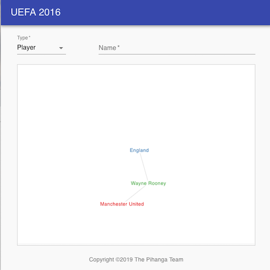
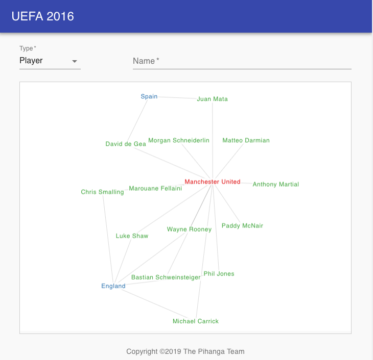

# Overview

Implements a simple Web UI to display the network of players, clubs and national teams of 
participating players at the 2016 UEFA Euro Cup. The graph database is served through a 
[GraphQL API](https://graphql.org/).

The UI consists of two screens. The first is a form which allows for selecting the initial 
players, clubs, or national teams to be displayed in the second, larger screen as an
interactive graph. Clicking on any of the graph nodes will expand (if not already expanded) 
the graph at that point by fetching more information from the backend.

_Note_: There is currently no way to reduce the displayed information except for altering the
search criteria in the top form which will clear the graph and start displaying potential _root_
nodes.

Dragging graph nodes and zooming in and out is supported through the usual means. However, selecting a
node requires selecting the middle of the label text. A selection target identifies itself by doubling 
the font size. This is obviously still demo material!

## Building

To build the javascript bundle and front page, run the `yarn build`
script which will create all the necessary artifacts to run the UI
in the `build` directory.

## Running

    % yarn server.js

This will start a web server listening at port 4000, and pointing
your web browser at `http://__this_machine_name__:4000` should show the following: 

Hovering over any of the elements and clicking it, will issue new queries for more information, potentially leading to:

# How does it work?

There are two parts to this example, a rather straight forward UI declaration via [app.pihanga.js](src/app.pihanga.js)
and the [GraphQL API](https://graphql.org/) based backend interaction primarily described in [app.queries.js](src/app.queries.js). Let us satrt with the UI part.

## UI Declaration

As with all __Pihanga__ apps, the starting point is the [app.pihanga.js](src/app.pihanga.js) file which
declares all the used cards, their properties and how it fits together. Let us begin with the entry point `page`.

    page: {
      cardType: 'PiPageR1',
      title: 'UEFA 2016',
      contentCard: 'content',
      footer: {copyright: 'The Pihanga Team'}
    },

`PiPageR1` is a card provided by the standard __Pihanga__ library and provides us with a minimal page card with a title bar (`title`), a single `contentCard` and an optional `footer`.

The content of the page is formatted in a grid using the `PiGrid` card:

    content: {
      cardType: 'PiGrid',
      spacing: 3,
      content: [{
        cardName: 'search',
        xs: 12, sm: 12, md: 12, item: true,
      }, {
        cardName: 'network',
        xs: 12, sm: 12, md: 12, item: true,
      }],
    },

The grid's `content` declares two sub cards in a columnar fashion as both cards stretch across all 12 grid columns (`xs: 12, sm: 12, md: 12`).

The `search` card is provided by `PiForm`, a card we have used in other examples. It consists of a select field to select the
type of entity we want to search for, and a text field to enter a partial match:
    search: {
      cardType: 'PiForm',
      fields: [{
        id: "type", 
        type: "selectField", 
        label: "Type",
        ...
      }, {
        id: "name", 
        type: "textField", 
        label: "Name",
        ...
      ],
      showSubmit: false,
      ...
    },

The `showSubmit: false` hides the submit button as we will immediately issue a query whenever any of the form input has changed to provide immediate feedback in the graph card.

And that brings us to the last card definition in [app.pihanga.js](src/app.pihanga.js), the `network` card:

    network: {
      cardType: 'Network',
      backgroundColor: 'white',
      nodeColorBy: 'type',
      data: s => s.graph,
      colorScheme: 'set1',
      nodeColorTypes: ['Club', 'Nat. Team', 'Player'],
    }, 

The `Network` card is locally implemented in [network](src/network) using the [react-force-graph](https://vasturiano.github.io/react-force-graph/) library and used to visualize the nodes and links stored in the redux state's `graph: {nodes: [...], links: [...]}` sub tree.

## GraphQL Backend Communication

In the spirit of _Pihanga_, the `@pihanga/graphql` package exports a `registerQuery` function through which we can declaratively declare a single query, the reduce action type it may trigger it, a function to extract the query variables from the current redux state, and two reducer functions, one for a successful query reply and an optional
one handling error replies.

Before we look at the queries in detail, it maybe useful to visit the GraphQL type declarations in [server.js](server.js):

    const typeDefs = gql`
      type Player {
        id: String
        name: String
        playsFor: Club
        represents: NationalTeam
      }

      type Club {
        id: String
        name: String
        players: [Player]
      }

      type NationalTeam {
        id: String
        name: String
        players: [Player]
      }

      type Query {
        players(id: String, match: String, limit: Int): [Player]
        clubs(id: String, match: String, limit: Int): [Club]
        nationalTeams(id: String, match: String, limit: Int): [NationalTeam]
      }
    `;

This defines three _data_ types; `Player`, `Club`, and `NationalTeam` and a `Query` type describing the supported top queries.

Let us start with the first query defined in [app.queries.js](src/app.queries.js) which requests an array of players whose name fuzzy matches `match` (the respective server side implementation can be found in the `dictQ` function):

    registerQuery({
      query: `
        query findPlayers($pattern: String, $limit: Int = 5) {
          players(match: $pattern, limit: $limit) {
            id
            name
          }
        }`, 
      trigger: actions('PiForm').VALUE_CHANGED,
      request: (a, s) => {
        if (a.id === 'search' && a.fieldID === 'name' & s.form.type === 'Player') {
          return {pattern: a.value};
        }
        return undefined; // ignore
      }, 
      reply: (state, reply) => {
        const graph = {
          nodes: reply.players.map(e => ({id: e.id, label: e.name, type: 'Player'})),
          links: [],
        };
        return update(state, ['graph'], graph);
      },
    });

The `query` parameter declares the query as defined in [GraphQL: Queries and Mutations](https://graphql.org/learn/queries/).

The `trigger` parameter declares the type of redux action this query may be triggered by, in our case this would be changes to any of the form fields.

The `request` parameter declares a function which is expected to return the assignments for the variables defined in 
the `query`, in our case that would be `pattern` and optionally `limit` (as a default of '5' was already provided). Returning `undefined` indicates that no query should be posted. In our case, we only want to issue this query if `Player` is selected in the `type` field and the content (`value`) of the text field `name` has changed.

Finally, the `reply` parameter is similar to a normal redux reducer function, except that instead of the action description the content of the graphql query is passed in. In this example, we only create graph nodes for each of the returned players with no links (`links: []`) and return an updated state with a completely new graph description.

The remaining queries follow the same pattern and primarily differ in how they modify the graph description based on the specific query reply.

An example of a more complex query can be found in `expandPlayer`:

    registerQuery({
      query: `query expandPlayer($id: String)  {
        players(id: $id) {
          id
          name
          represents {
            id
            name
          }
          playsFor {
            id
            name
          }
        }
      }`,
      ...
      reply: (state, reply) => {
        const p = reply.players[0]; // only one array element is expected.
        if (!p) {
          // something went wrong
          return state;
        }
        let nodes = state.graph.nodes;
        let links = state.graph.links;

        const club = p.playsFor;
        if (club) {
          nodes = addNode(nodes, club.id, club.name, 'Club');
          links = addLink(links, p.id, club.id, 'playsFor');
        }

        const nat = p.represents;
        if (nat) {
          nodes = addNode(nodes, nat.id, nat.name, 'Nat. Team');
          links = addLink(links, p.id, nat.id, 'represents');
        }
        return update(state, ['graph'], {nodes, links});
      },
    });

This query requests for a single player (`$id`), the id and name of the club he plays for as well as the id and name of the national team he represents. In the `reply` function we may need to add two new nodes, one for the club and one for the national team as well as two link from the player node to the respective club and national team node.

# Developer

To further develop the UI start the development server with

    % yarn start

and the respective GraphQL server with:

    % yarn server-dev
