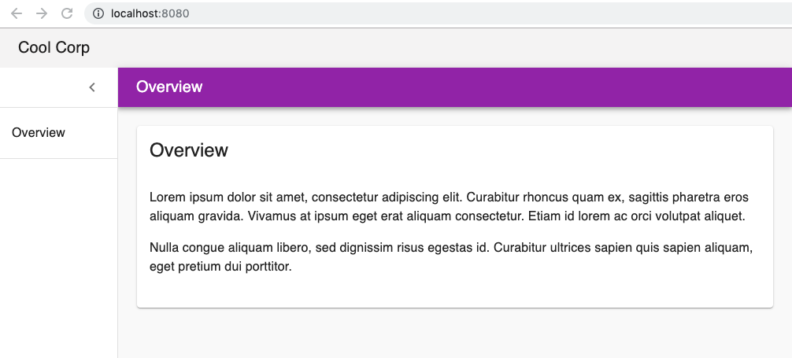
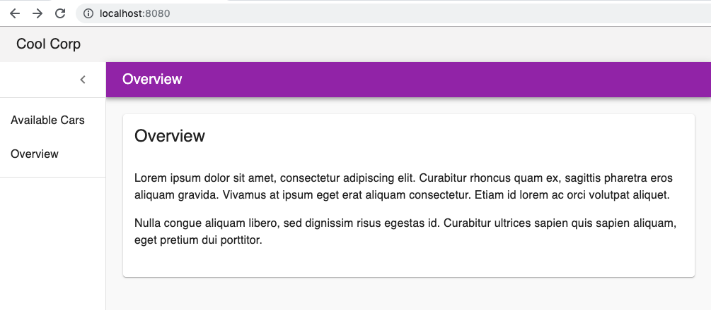
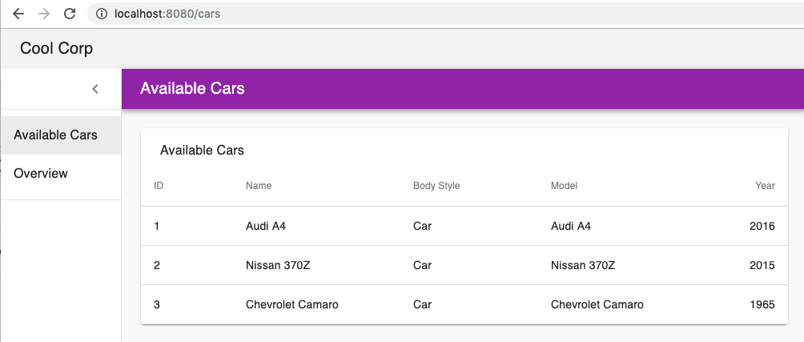
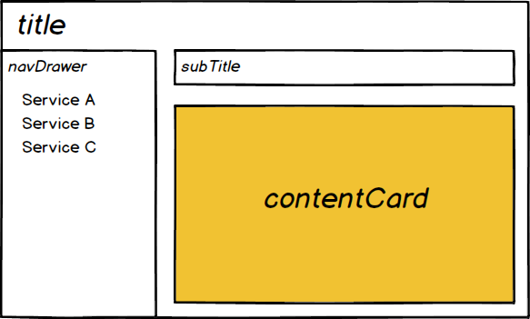

# Overview

Implements a simple Web UI which can be dynamically extended by simply adding additional javascript files
into the main page.

# Quick Demo

Let us quickly run through a few steps to demonstrate on how we can dynamically add UI components provided by a micro service 
without having to change any code in the core application.

## Step 1: Build Base UI

The basic scaffolding is implemented in `core`. To build it:

    cd core
    yarn install
    yarn build
    cd ..

This is a _normal__ React application and could already be previewed by running `yarn start` in the `core` directory.

## Step 2: Start Test Server

In the top directory of this example you'll find a `server.js` file which contains a simple [express](https://expressjs.com) web application. Assuming you have _express_ installed in a global context (`npm install express --save`), you an start the server with:

    node server.js
    ...
    Server listening on port 8080!

Pointing a web browser to `http://localhost:8080` should show a page like:

  

## Step 3: Add an Additional Service

If we want to add a new 'Cars' service and make accesible through the left menu, do the following:

    cd car-service
    yarn install
    yarn build

This creates a `car-service.js` file in the `build` directory.

Now lets return to the parent directory and re-start the test server.

    node server.js
    ...
    Server listening on port 8080!

Returning back to the web browser and refreshing the page should now show a page like:

  

And clicking on the new service, should transition to the top page of that service:

  

# So how does this work?

## Bootstrapping

As mentioned above, the core application is built as a standard __Pihanga__ application with a few 
minor additions which will allow extensions to register themselves before the core is calling `pihangaStart`.

The primary idea is to create a _rendezvous point_ on the `index.html` page followed by `script` tags loading the
extensions, followed by the core libraries. 

    <body style="height: 100%; margin: 0" >
        

        <!-- Rendezvous point for extensions -->
        
        <!-- extensions -->
        
        <!-- core and REACT runtime -->
        
        
        
    </body>

The global `Pihanga` acts as the _rendezvous point_ between the core and the extensions. Let us first look at how
an extension registers with the core.

In [car-service/src/index.js](car-service/src/index.js), we find the following code snippet:

    export function bootstrapInit(opts) {
        const cardDefs = cardDefsF(opts);
        return register => {
            ... // Called during the normal Pihanga bootstrpa process
        };    
    }

    if (window.Pihanga) {
      window.Pihanga.BootstrapInit.push(bootstrapInit);
    }

When the `car-service.js` script gets loaded and the code in `index.js` gets executed it only attaches the local function `bootstrapInit`
to the global `window.Pihanga.BootstrapInit` array and immediately returns.

Now, let us have a look at the [core/src/index.js](core/src/index.js). Beside the usual __Pihanga__ bootstrapping code, we find the following, additional fragment:

    if (window.Pihanga) {
        ...
        if (Array.isArray(window.Pihanga.BootstrapInit)) {
            const opts = exportModule({}, require('./app.pihanga'));
            window.Pihanga.BootstrapInit.forEach(f => {
                const initF = f(opts);
                if (initF) {
                    inits.push(initF);
                } else {
                    logger.error("extension bootstrap didn't return anything for ", f);
                }
            });
        }
    }

    pihangaStart({
        ...
        inits,
        ...
    });

The first few lines test if the rendezvous points were defined in `index.html`, specifically `window.Pihanga.BootstrapInit[]`. If it exists, we first collect all the helper functions defined in [./app.pihanga.js](core/src/app.pihanga.js) (`const opts = ...`) and then calls all the functors registered in
`BootstrapInit`. The returned functions is then added to the `inits` function array which later becomes a parameter to `pihangaStart` and 
therefore becomes part of the normal __Pihanga__ bootstrap process.

## Dynamic Extensions

This demo implements a standard pattern consisting of page title, a navigation list  on the left, and a service specific  content  with a  title on the right.

  

Specifically, we want any extension library to add its respectively offered service to the navigation list on the right and then display its specific content  in the content  section on the right.

The basic setup for this pattern is declared in [core/src/app.pihanga.js](core/src/app.pihanga.js). Before we describe the declaration of the root card `page`, let us have a look at the declarations relevant parts of _default_ `contentCard`:

    overview: {
        ...
        title: 'Overview',
        isTopLevel: true,
        isRouteSelected: routeSel('overview'),
        ...
    },

The function `routeSel` is defined elsewhere in [core/src/app.pihanga.js](core/src/app.pihanga.js) and essentially returns true if the respective URL is equal to `http://localhost/overview`. The property `isTopLevel` indicates that this is a top level service and should be listed in the service listing on the left. Any other service added will have a card declared with a similar set of properties.

Now let's have a look at the root card `page`:

    page: {
        cardType: 'PageD1',
        title: 'Cool Corp',
        subTitle: (_, ref) => {
            const c = ref('page', 'contentCard');
            const title = ref(c, 'title');
            return title;
        },
        contentCard: flow(
            pQuery(null, 'isRouteSelected', true),
            (a) => a.length === 1 ? a[0].cardName : 'overview'
        ),
        navDrawerCard: 'navDrawer',
        drawerIsOpen: ref('navDrawer', 'drawerIsOpen'),
        onOpenDrawer: () => () => {  // redirect open drawer action to 'navDrawer'
            dispatch({ 
                type: actions('PiNavDrawer').OPEN_DRAWER, 
                id: 'navDrawer',
            });
        },
        ...
    },

Let us begin with having a closer look at `contentCard` which  declares the name of the service content card to display on the right (e.g. the above `overview` one):

    contentCard: flow(
        pQuery(null, 'isRouteSelected', true),
        (a) => a.length === 1 ? a[0].cardName : 'overview'
    ),

We are using Lodash's [flow](https://lodash.com/docs#flow) to chain two selectors. The first one `pQuery(null, 'isRouteSelected', true)` finds all the card declarations whose `isRouteSelected` property is bound to `true`. The second selector `(a) => ...` expects an array of card declarations of either length 0 (no content selected) or 1 (a specific service card). For any array of length not equal 1, the default service card (`overview`) is returned, otherwise the selected card's `cardName` is returned.

Beside dynamically selecting a content card from the app's path, the page's sub title is taken from the `title` property of the content card which is declared as follows:

    subTitle: (_, ref) => {
        const c = ref('page', 'contentCard');
        const title = ref(c, 'title');
        return title;
    },

The second argument to the binding function is a lookup function on another card declaration. `ref('page', 'contentCard')` returns the property `contentCard` of card `page`, while `ref(c, 'title')` returns that card's `title` property. For the default case, the first `ref()` returns `overview`, whose 'title' property has been bound above to `'Overview'`.

The navigation list on the left is implemented as a [navigation drawer](https://material.io/components/navigation-drawer/). The `PageD1` card type only provides a container for a 'drawer' card and a 'drawer open' icon with associated _Redux__ action. Let us look at the relevant section in the `page` declaration in more detail:

        ...
        navDrawerCard: 'navDrawer',
        drawerIsOpen: ref('navDrawer', 'drawerIsOpen'),
        onOpenDrawer: () => () => {  // redirect open drawer action to 'navDrawer'
            dispatch({ 
                type: actions('PiNavDrawer').OPEN_DRAWER, 
                id: 'navDrawer',
            });
        },
        ...

The first property `navDrawerCard` declares the name of card to display inside an open drawer. The state of the drawer - closed or open - is also taken from that card (`ref('navDrawer', 'drawerIsOpen')`). Finally, the _Redux_ action to be dispatched when the 'open drawer' icon is clicked is redefined to use an action type associated with the card type (`PiNavDrawer`) of the nav drawer.

The last missing piece in setting up the app's page structure is the nav drawer itself.

    navDrawer: {
        cardType: 'PiNavDrawer',
        drawerIsOpen: true,
        navItems: flow(
            pQuery(null, 'isTopLevel', true, ['title', 'path']),
            mapF(e => ({name: e.title, path: e.path}))
        ),
        onClickNavMenu: () => ({item}) => {
           navigateToPage(item.path);
        },
    },

__Pihanga__ resolves the binding of a card property in multiple steps. Step one is to look for a value in the _Redux_ state at `pihanga._cardName_._propertyName_`. If a value is found, it becomes the current binding for the respective property. If not, the 
value in above declaration is being used. In the case of `drawerIsOpen`, `true` is the default value, but the reducers for `PiNavDrawer`
modify the _Redux_ state for `pihanga.navDrawer.drawerOpen` as can be seen in [nav-drawer.reducers.js](../../packages/material/src/card/nav-drawer/nav-drawer.reducers.js):

    export default (registerReducer) => {
        registerReducer(ACTION_TYPES.OPEN_DRAWER, (state, action) => {
            return drawerState(true, state, action);
        });

        registerReducer(ACTION_TYPES.CLOSE_DRAWER, (state, action) => {
            return drawerState(false, state, action);
        })

        function drawerState(drawerIsOpen, state, action) {
            return update(state, [ 'pihanga', action.id ], {drawerIsOpen});
        }
    }

The list of services to display in the nav drawer is bound to `navItems`. Like in `page`, [flow](https://lodash.com/docs#flow), `pQuery`, and a `flatMap` variant are used to a) find all cards whose `topLevel` property is bound to `true` and b) map their respective `title` and `path` properties to a dictionary with keys `name` and `path`.

Finally, the `onClick` handler for the above generated list is bound to a function which dispatches a `ROUTER:NAVIGATE_TO_PAGE` action through the `navigateToPage` helper function. The associated reducer will change the _Redux_ state of `route.path` to the respective value, which in turn may change the displayed content in the above described `isRouteSelected: routeSel(...)` property and binding function.
