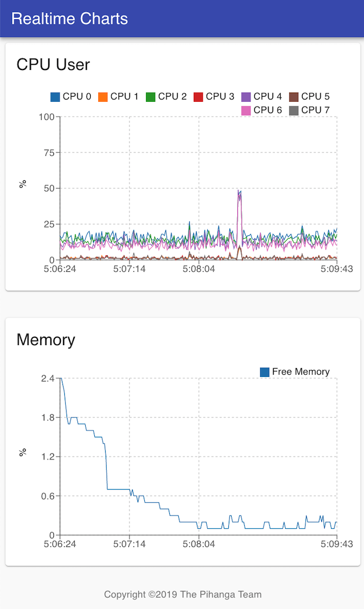
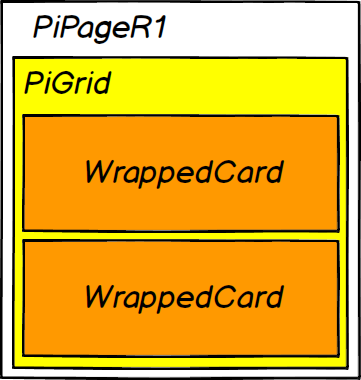

# Overview

Implements a simple Web UI to display the recent CPU  load as well as memory availability for the web server.

The UI consists of a single page showing two line charts, one
for the CPU load and one for the memory consumption.

Periodically the front end is querying a REST API provided by the serving web server for the most recent measurements.

## Demonstrates:

* Meta cards
* Periodic GET from REST Client
* Recharts package

## Building

To build the javascript bundle and front page, run the `yarn build`
script which will create all the necessary artifacts to run the UI
in the `build` directory.

## Running

    % yarn
    % yarn server

This will start a web server listening at port 8080, and pointing
your web browser at `http://__this_machine_name__:8080` and you should see something like:



# How does it work?

As with all __Pihanga__ apps, the starting point is the [app.pihanga.js](src/app.pihanga.js) file which
declares all the used cards, their properties and how it fits together.

But before we have a look at that, we need to understand the workflow implemented by this app.

## Single Page App

We build a very simple app with titled page containing a single grid layout card for the content, which in turn holds two cards dispaying a line chart, one for CPU and one for memory use.



    const page = {
        page: {
            cardType: 'PiPageR1',
            contentCard: 'graphs',
            title: 'Realtime Charts',
            footer: {copyright: 'The Pihanga Team'}
        },

        graphs: {
            cardType: 'PiGrid',
            spacing: 3,
            content: ['cpuGraph', 'memoryGraph', ],
        }, 

        cpuGraph: {
            cardType: 'WrappedCard',
            title: 'CPU User',
            ...
        },

        memoryGraph: {
            cardType: 'WrappedCard',
            title: 'Memory',
            ...
        }
    };

The first two card definitions are rather straight forward, while the
card type `WrappedCard` is a locally defined _Meta Card_. A _Meta Card_ does not represents any actual cards, but will instead return a named list of new cards which are dynamically inserted into the card declaraton list. Please note, that any of the returned cards can be a
_Meta Card_ leading to a recursive expansion.

Now lets have a look at the definition of `WrappedCard` which we can 
find at the beginning of [app.pihanga.js](src/app.pihanga.js):

```
export function init(register) {
  ...
  register.metaCard('WrappedCard', (name, defs) => {
    const {
      cardType, title,
      yLabel, metricsType, maxY = 100,
      ...inner
    } = defs;
    const innerName = `${name}-inner`;
    const h = {};
    h[name] = {
      cardType: 'MuiCard',
      title,
      contentCard: innerName,
    }
    h[innerName] = {
      cardType: 'ReLineChart',
      data: s => s.metrics[metricsType],
      ...
    }
    return h;
  });
}
```

## Realtime Updates

[backend.js](src/backend.js):
```
const METRICS_URL = '/metrics?after=:after';
const UPDATE_INTERVAL_MS = 2000;

export function init(register) {
  registerPeriodicGET({
    name: 'getMetrics',
    url: METRICS_URL,
    intervalMS: UPDATE_INTERVAL_MS,

    start: '@@INIT',
    init: (state) => {
      const m = {metrics: {...}};
      return update(state, [], m);
    },

    request: (state) => {
      const lastTS = state...
      return {after: lastTS};
    },
    reply: onMetricsUpdate,
  });
}

function onMetricsUpdate(state, reply) {
  ...
  return update(state, ['metrics'], metrics);
}
```


# Developer

To further develop the UI start the development server with

    % yarn start

and start the server in a different shell with:

    % yarn server

Any API request to the development server on port 3000 will be forwarded to the app server according to the

    "proxy": "http://localhost:8080",

setting in `package.json'.
