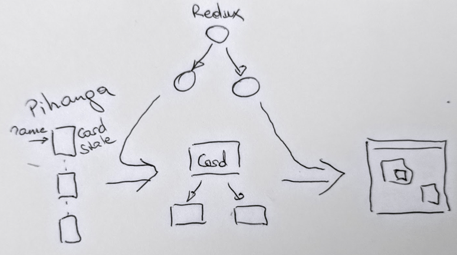

<div style="background-color: #f1f8ff; border-color: #0366d6">
  <p>This is still <b>VERY</b> experimental</p>
</div>

Pihanga - Framework for dynamically extendible React apps
===

> [pihanga](https://s3.amazonaws.com/media.tewhanake.maori.nz/dictionary/38608.mp3)
>  (noun) window, sliding slab of the traditional window of a wharenui.

Motivation
---

Most of the web frontends we are usually building are for a rather small user base to better use or maintain rather complex backends. Many of those systems start out small but over time expand in various directions by different teams using different technologies. Most likely a common scenario for many business support services.

We use micro services and similar technologies to avoid any unnecessary dependencies in the backend, but our users, understandably want a unified UX in the frontend.

This project is an attempt to achieve that while supporting the independent development of the various parts and components surfacing specific backend capabilites. In other words, we want to minimize the amount of code changes when adding new functionality while still supporting an integrated UX experience.

Let me explain that with a trivial example. Let us assume we just delivered an internal car booking service for a company. After a successful launch a different part of the business in charge of managing the truck fleet wants to add their service to it, as well. Their backend is very different and the original frontend team has already been dissolved. We want to make it easy for the "truck" team to independently develop the truck specific UX components as well as extension points to existing generic functionality, such as search, without needing to modify the car components. Frontend integration should be as simple as adding an additional script link to the index page.

Approach
---

We have found the React/Redux approach to be extremely useful in managing dependencies between UX components and cleanly separating state synchronisation between front- and backend. In addition, a purely functional approach to component design not only leads to much cleaner code, but also simplifies testing considerably.

With the positive lessons learned from defining a web page as pure functions over a single state structure, we wanted to see if we can push this further and essentially select those functions through another function over a _UX_ state object.



In order to do that, we need to define a _construction_ model for a web page. In _Pihanga_, like in other frameworks, a page is composed of hierarchically nested **cards**. Or, in other words, a _tree of cards_ with the root of the tree being the entire page frame. Each card can contain normal web components as well as other cards. However, we restrict a card to define an embedded card only by a tree-globally unique name. In addition, each card is stateless and it's final presentation and behaviour defined by a set of externally provided properties (which may include the name to be assigned to an embedded card).

The _Pihanga_ state structure, different to the _Redux state tree_, is a map between the _name_ of a card and it's associated property list. However, the values in that property list can be queries (currently functions) over the entire _Pihanga_ state (all other cards) and the _Redux_ state.

Let's demonstrate that on a simple app consisting of a frame-filling `page` card which will show one of two listing cards depending on the `route.routePath` property in the Redux state.

The _Pihanga_ state structure is defined as follows:

```javascript
import flow from 'lodash.flow';
import { pQuery } from '@pihanga/core'card.service';

export default {
  page: {
    cardType: 'AppPage',
    title: 'Transportation Service',
    contentCard: flow(
        pQuery(null, 'path', (s) => s.route.routePath),
        (a) => a.length == 1 ? a[0].cardName : 'carListing'
    ),
    //...
  },
  carListing: {
    cardType: 'Table',
    title: 'Cars',
    path: '/cars',
    //...
  },
  truckListing: {
    cardType: 'Table',
    title: 'Trucks',
    path: '/trucks',
    //...
  },
}
```

and the `AppPage` card is implemented as follows: 

```javascript
import { Card } from '@pihanga/core';

export const AppPageCard = ({
  title,
  contentCard, 
  //...
}) => {
  return (
    <div>
      ...
        <Card cardName={contentCard} />
      ...
    </div>
  );
};
```
The `contentCard` property in the `page` card definition shows the use of query to dynamically calculate the property value. `pQuery` returns an query over the _Pihanga_ state. `pQuery(null, 'path', (s) => s.route.routePath)` selects all card defintions (`null` wildcard) where the `path` property (if defined) is equal to the current _Redux_ value `route.routePath`. For the current setup, the query will return zero or one records which is reduced in the second function to `flow` either the name of the single matching card or a default card.


